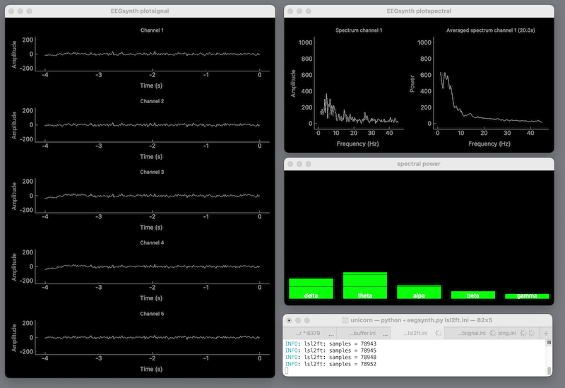

# Online theta monitoring

This repository contains the code for a real-time EEG system for infants that allows the online monitoring of brain activity in infants while they are in interaction with their environment. This is developed as part of the [SAPIENS](http://sapiens-itn.eu) project.

The code here is implemented to be independent of the EEG hardware that is being used, but includes specific configurations for two systems: the BrainProducts BrainAmp and the Gtec Unicorn BrainProducts BrainAmp.

## BrainProducts BrainAmp

This is a research quality EEG system located in our baby EEG lab. For children and infants we use it with 32 channels and active electrodes uniformly distributed over the head. To use the BrainAmp for online theta monitoring you should enable the real-time RDA interface that is provided in the BrainVision Recorder application.

## Unicorn Hybrid Black

This is an 8-channel wireless and wearable EEG system with hybrid (dry or gelled) electrodes. As the comfort of dry electrodes might not be optimal for children or infants, we are developing and testing a prototype based on the Unicorn Naked with more comfortable wet sponge electrodes. To use the Unicorn (Hybrid Black or Naked) for online theta monitoring, you should use the real-time interface provided with the UnicornLSL application.

## EEGsynth

The data is streamed over the network and analyzed in real-time in the Open Source [EEGsynth](https://www.eegsynth.org) software. The current patch only visualizes the power in the different EEG bands, but it would also be possible to stream the power over MIDI, OSC, ArtNet, DMX, MQTT, ZeroMQ, LSL, TCP, or UDP.
