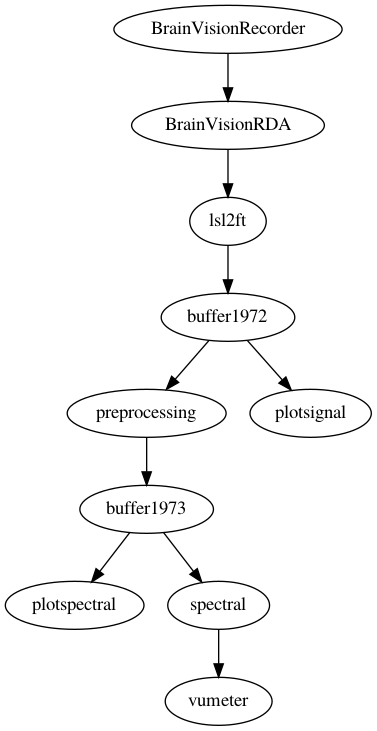

# BrainVision EEG streaming

This patch uses the [BrainVisionRecorder](https://brainvision.com/products/recorder/) and the [BrainVisionRDA](https://github.com/brain-products/LSL-BrainVisionRDA) applications to stream the data from the amplifier to LSL.

Selected channels of the raw data are plotted (with some filtering) prior to rereferencing. The data is rereferenced using a Hjorth spatial filter centered over a frontal channel (FCz). The full spectrum of the frontal channel is plotted. The theta power is computed over a pre-specified band and plotted as a VU meter.

## Schematic representation of the patch



## Instructions for starting the patch

```
Place ActiCap EEG cap on participant and ensure that electrodes have good impedance.

Start BrainVisionRecorder on the windows acquisition computer, enable the RDA interface. Start BrainVisionRDA on the windows acquisition computer, this receives the data from RDA and streams it over LSL.

The EEGsynth patch can run on the same windows computer, but also on another Linux or macOS computer that is connected to the same network.

Ensure that Redis is running on the analysis computer.

Start EEGsynth patch, one module at a time:
- conda activate eegsynth
- python eegsynth/bin/eegsynth.py buffer.ini
- python eegsynth/bin/eegsynth.py lsl2ft.ini
- python eegsynth/bin/eegsynth.py plotsignal.ini
- python eegsynth/bin/eegsynth.py preprocessing.ini
- python eegsynth/bin/eegsynth.py plotspectral.ini
- python eegsynth/bin/eegsynth.py spectral.ini
- python eegsynth/bin/eegsynth.py vumeter.ini

Or start EEGsynth patch, all at once:
- conda activate eegsynth
- python eegsynth/bin/eegsynth.py *.ini

```
